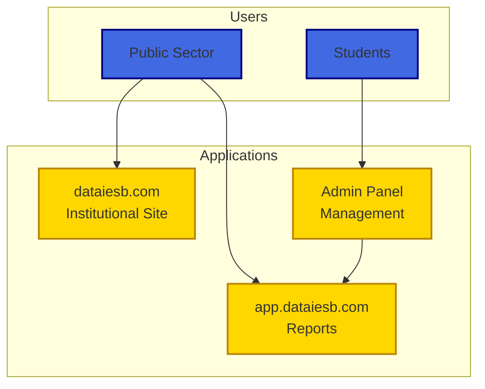
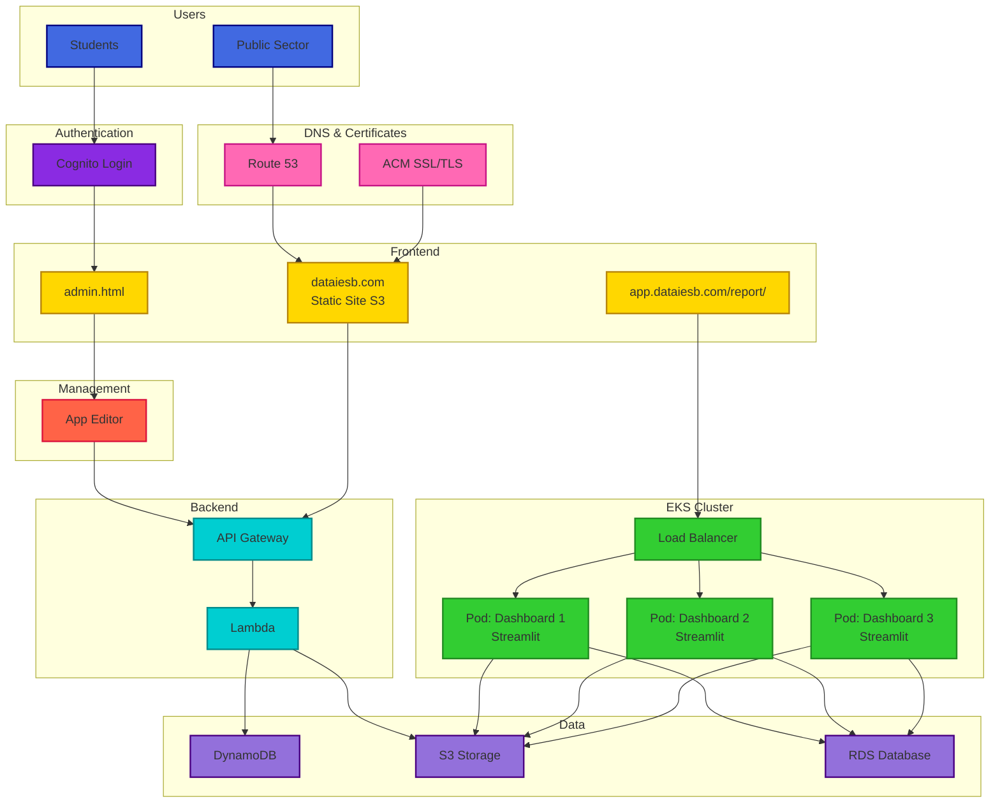
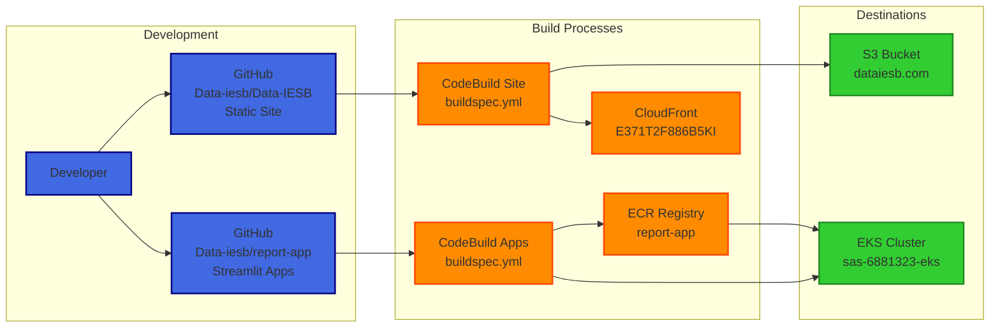

# Big Data IESB Platform

[](https://github.com/Data-iesb/Data-IESB/actions/workflows/deploy-main.yml)

**Author**: Roberto Moreira Diniz  
**GitHub**: [github.com/s33ding](https://www.github.com/s33ding/)  
**LinkedIn**: [linkedin.com/in/s33ding](https://linkedin.com/in/s33ding)

The **Big Data IESB Project** is a strategic initiative focused on creating and maintaining a structured data platform composed of public information and, when applicable, proprietary data from partner organizations. The main objective is to provide a comprehensive analytical foundation that contributes to improved decision-making, increased public management efficiency, evidence-based policy formulation, and higher quality services to the population.

The platform is designed to serve different user profiles, particularly the public sector, civil society organizations, and educational institutions, promoting innovative data-driven solutions focused on efficiency, innovation, and social responsibility. The project covers diverse areas of social and governmental interest, including health, education, environment, public safety, human rights, labor market, public finance, social assistance, housing, and urban development.

## 🌐 Platform Access

- **Main Website**: https://dataiesb.com - Institutional site for public sector and general users
- **Reports Dashboard**: https://app.dataiesb.com/report/ - Interactive analytics dashboards
- **Admin Panel**: Administrative interface for content management
- **Development**: https://d2v66tm8wx23ar.cloudfront.net

## 🏗️ Platform Architecture

The system has been refactored to a **serverless architecture** using native **Amazon Web Services (AWS)** services. Website storage and hosting were migrated to **Amazon S3**, configured with appropriate permissions via **Access Control List (ACL)** and distributed as a high-availability public site. The domain was acquired and configured through **Amazon Route 53**, with digital certificates issued by **AWS Certificate Manager (ACM)** and accelerated content distribution via **Amazon CloudFront**.

### User Access Flow


### AWS Infrastructure


### CI/CD Pipeline


### Infrastructure as Code (IaC)

```mermaid
graph TD
    subgraph "DataIESB IaC"
        TF_MAIN[main.tf<br/>Core Resources]
        TF_VARS[variables.tf<br/>Configuration]
        TF_OUT[outputs.tf<br/>Export Values]
    end
    
    subgraph "report-app IaC"
        IAAC[iaac/<br/>Infrastructure Scripts]
        DDB[dynamodb.sh<br/>DynamoDB Tables]
        PUB[make-public.sh<br/>S3 Public Config]
    end
    
    subgraph "Kubernetes Manifests"
        EKS_DIR[eks/<br/>K8s Manifests]
        DEP[deployment.yaml<br/>App Deployment]
        SVC[service.yaml<br/>Load Balancer]
        SA[eksctl-sa.sh<br/>Service Account]
        POL1[s3-policy-fix.json<br/>S3 Permissions]
        POL2[s3-policy-updated.json<br/>Updated Policies]
    end
    
    subgraph "AWS Resources"
        DYNAMO[DynamoDB<br/>DataIESB-TeamMembers<br/>dataiesb-reports]
        S3_BUCKET[S3 Buckets<br/>dataiesb<br/>dataiesb-reports]
        COGNITO[Cognito<br/>User Pool]
        R53[Route 53<br/>dataiesb.com]
        ACM_CERT[ACM Certificate<br/>SSL/TLS]
        EKS_CLUSTER[EKS Cluster<br/>sas-6881323-eks]
        PODS[Kubernetes Pods<br/>report-app]
        LB[Load Balancer<br/>Service]
    end
    
    TF_MAIN --> DYNAMO
    TF_MAIN --> S3_BUCKET
    TF_MAIN --> COGNITO
    TF_MAIN --> R53
    TF_MAIN --> ACM_CERT
    
    IAAC --> DDB
    IAAC --> PUB
    DDB --> DYNAMO
    PUB --> S3_BUCKET
    
    EKS_DIR --> DEP
    EKS_DIR --> SVC
    EKS_DIR --> SA
    EKS_DIR --> POL1
    EKS_DIR --> POL2
    
    DEP --> PODS
    SVC --> LB
    SA --> PODS
    POL1 --> PODS
    POL2 --> PODS
    PODS --> EKS_CLUSTER
    LB --> EKS_CLUSTER
    
    classDef tfClass fill:#623CE4,stroke:#4B0082,stroke-width:2px
    classDef iacClass fill:#9370DB,stroke:#4B0082,stroke-width:2px
    classDef k8sClass fill:#326CE5,stroke:#1E3A8A,stroke-width:2px
    classDef awsClass fill:#FF9900,stroke:#CC7A00,stroke-width:2px
    
    class TF_MAIN,TF_VARS,TF_OUT tfClass
    class IAAC,DDB,PUB iacClass
    class EKS_DIR,DEP,SVC,SA,POL1,POL2 k8sClass
    class DYNAMO,S3_BUCKET,COGNITO,R53,ACM_CERT,EKS_CLUSTER,PODS,LB awsClass
```


## 🛠️ Technology Stack

### Frontend & Static Content
- **Amazon S3**: Static website hosting with public ACL configuration
- **Amazon CloudFront**: Content delivery network for global distribution
- **HTML5/CSS3/JavaScript**: Modern web standards for responsive design

### Backend & APIs
- **AWS Lambda**: Serverless functions for API backend
- **API Gateway**: RESTful API endpoints
- **Amazon Cognito**: Authentication and user management with institutional domain restrictions

### Data & Analytics
- **Amazon DynamoDB**: NoSQL database for dynamic data storage
- **Amazon RDS**: Relational database for structured data
- **Streamlit**: Interactive dashboard framework deployed on EKS

### Container Orchestration
- **Amazon EKS**: Kubernetes cluster for Streamlit applications
- **Docker**: Containerization for consistent deployments
- **Amazon ECR**: Container registry for Docker images

### Infrastructure & DevOps
- **AWS Route 53**: DNS management and domain configuration
- **AWS Certificate Manager**: SSL/TLS certificate management
- **AWS CodeBuild**: Continuous integration and deployment
- **GitHub Actions**: Additional CI/CD workflows

## 🏗️ Repository Structure

This repository contains the **static website** component of the Big Data IESB Platform. The complete platform consists of multiple repositories:

### Main Repositories
- **Data-IESB** (this repo): Static institutional website
- **report-app**: Streamlit dashboard applications
- **Infrastructure**: Terraform and Kubernetes manifests

### Directory Structure
```
Data-IESB/
├── src/                          # Website source files
│   ├── index.html               # Homepage
│   ├── quem-somos.html          # About us page
│   ├── equipe.html              # Team page (dynamic)
│   ├── admin.html               # Administrative interface
│   ├── style/                   # CSS files
│   ├── js/                      # JavaScript files
│   └── img/                     # Images and assets
├── .github/                     # GitHub configuration
│   ├── workflows/               # CI/CD pipelines
│   ├── ISSUE_TEMPLATE/          # Issue templates
│   ├── CODEOWNERS              # Code review assignments
│   └── pull_request_template.md # PR template
├── deploy-main.sh              # Production deployment script
├── main-config.json            # Production environment config
└── buildspec.yml               # AWS CodeBuild configuration
```

## 🚀 Quick Start for Contributors

### 1. Clone the Repository
```bash
git clone https://github.com/Data-iesb/Data-IESB.git
cd Data-IESB

# You'll be on the 'main' branch (production)
git branch
# * main
```

### 2. Create Your Feature Branch
```bash
# Create a new feature branch from main
git checkout -b feature/your-feature-name

# Make your changes
# ... edit files ...

# Commit your changes
git add .
git commit -m "feat: describe your changes"

# Push your feature branch
git push origin feature/your-feature-name
```

### 3. Create Pull Request
- Go to GitHub and create a PR from your feature branch to `main`
- Fill out the PR template
- Request review from team members
- After approval, your changes will be automatically deployed to production

## 🔄 Branch Strategy

### Branch Overview
- **`main`** ← **Production branch** (protected)
  - Production environment
  - Deploys to https://dataiesb.com
  - Requires admin approval
  
- **`dev`** ← Development branch
  - Development environment
  - Auto-deploys to https://d2v66tm8wx23ar.cloudfront.net
  - For testing and development

### Workflow
```
feature/new-feature → main → production
```

## 🛡️ Branch Protection

### Main Branch (Production)
- 🔒 Requires 2+ approvals
- 🔒 Admin-only access
- 🔒 Strict status checks
- 🔒 Code owner reviews required

## 🧪 Production Environment

### Infrastructure
- **S3 Bucket**: `dataiesb.com`
- **CloudFront**: `E371T2F886B5KI`
- **Auto-deployment**: On push to `main` branch

### Local Development
```bash
# Serve locally
cd src
python -m http.server 8000
# Visit: http://localhost:8000

# Or use any static file server
npx serve src
```

## 🎨 Platform Features

### Multi-Domain Focus Areas
The platform covers diverse areas of social and governmental interest:
- **Health**: Public health indicators and analytics
- **Education**: Educational metrics and performance data
- **Environment**: Environmental monitoring and sustainability metrics
- **Public Safety**: Security and crime statistics
- **Human Rights**: Social justice and equality indicators
- **Labor Market**: Employment and economic indicators
- **Public Finance**: Budget transparency and fiscal data
- **Social Assistance**: Welfare and support program analytics
- **Housing & Urban Development**: Infrastructure and development metrics

### Technical Features
- **Dynamic Team Management**: Team data loaded from DynamoDB
- **Interactive Dashboards**: Streamlit-based analytics interfaces
- **Responsive Design**: Mobile-first, cross-browser compatibility
- **Secure Authentication**: Cognito-based user management
- **Real-time Updates**: Live data integration and updates
- **Scalable Architecture**: Serverless and container-based infrastructure

## 👥 Project Team

### Academic Coordination
- **Professor Sérgio da Costa Côrtes** - Project Coordinator
- **Professor Simone de Araújo Góes Assis** - Academic Supervisor
- **Professor Natália Ribeiro de Souza Evangelista** - Research Coordinator

### Technical Leadership
- **Roberto Moreira Diniz** - DevOps & Cloud Infrastructure
- **Ilton Ferreira Mendes Neto** - Database Administrator
- **Marley Abe Silva** - Full Stack Developer
- **Leonardo Araújo Pereira** - Data Science Team Leader

### Data Science & Analytics Team
- **Guilherme Rocha Duarte** - Data Scientist
- **Leonardo Borges Silva Braga** - Data Analyst
- **Pedro Martins Rodrigues** - Research Assistant
- **William Wallace Ribeiro Matos** - Analytics Specialist

### Target Users
- **Public Sector**: Government agencies and public administrators
- **Civil Society Organizations**: NGOs and community groups
- **Educational Institutions**: Researchers and students
- **IESB Community**: Applied learning and research opportunities

## 🚀 Deployment

### Automatic (Recommended)
1. Push to `main` branch
2. GitHub Actions automatically deploys
3. Changes live in 5-15 minutes

### Manual
```bash
# Ensure you're on main branch
git checkout main

# Run deployment script
./deploy-main.sh
```

## 📋 Contributing

### For Contributors
1. **Fork** the repository
2. **Clone** your fork
3. **Create** feature branch: `git checkout -b feature/amazing-feature`
4. **Make** your changes
5. **Test** locally
6. **Commit** with clear messages
7. **Push** to your fork
8. **Create** Pull Request to `main` branch

### Code Style
- Use semantic HTML5
- Follow CSS BEM methodology
- Write clear, commented JavaScript
- Maintain responsive design
- Test on multiple browsers

### Commit Messages
```bash
feat: add new team member display
fix: resolve mobile navigation issue
style: update color scheme consistency
docs: improve setup instructions
```

## 🔧 Infrastructure Configuration

### AWS Services Overview
- **S3 Buckets**: 
  - `dataiesb.com` - Production static website
  - `dataiesb-reports` - Analytics data storage
- **CloudFront Distribution**: `E371T2F886B5KI` - Global CDN
- **EKS Cluster**: `sas-6881323-eks` - Container orchestration
- **DynamoDB Tables**: 
  - `DataIESB-TeamMembers` - Team information
  - `dataiesb-reports` - Analytics metadata
- **Route 53**: Domain management for dataiesb.com
- **Certificate Manager**: SSL/TLS certificates
- **Cognito User Pool**: Authentication and authorization

### Environment Configuration
- **Production**: Fully managed AWS infrastructure
- **Development**: Automated deployment via GitHub Actions
- **Local Development**: Static file serving for testing

### Security & Access Control
- **Cognito Integration**: Institutional domain restrictions
- **IAM Policies**: Least privilege access controls
- **SSL/TLS**: End-to-end encryption via ACM certificates
- **VPC Configuration**: Secure network isolation for EKS

## 📚 Documentation

- **[Development Guide](DEV-README.md)** - Complete dev environment docs
- **[Branch Change Guide](change-default-branch.md)** - How to change default branch
- **[Color Templates](src/miv.html)** - Brand color combinations

## 🐛 Issues & Support

### Reporting Issues
- Use issue templates for bugs and features
- Include environment details
- Add screenshots when helpful
- Tag appropriate team members

### Getting Help
- Check existing issues first
- Use discussions for questions
- Contact DevOps team for infrastructure issues

## 📄 About IESB

**Centro Universitário IESB** is committed to fostering innovation in education and research. The Big Data IESB Platform represents a significant step toward evidence-based decision making and serves as a practical learning environment where students and researchers can apply Data Science and Artificial Intelligence methodologies to real-world scenarios, contributing to the social and institutional development of Brazil.

### Educational Impact
- **Applied Learning**: Students work with real data and modern cloud technologies
- **Research Opportunities**: Platform supports academic research in data science
- **Industry Preparation**: Hands-on experience with enterprise-grade AWS services
- **Social Contribution**: Projects focused on public benefit and social improvement

---

## 🎯 Quick Access Links

- **Main Platform**: https://dataiesb.com
- **Analytics Dashboard**: https://app.dataiesb.com/report/
- **Development Environment**: https://d2v66tm8wx23ar.cloudfront.net
- **GitHub Repository**: https://github.com/Data-iesb/Data-IESB
- **Issues & Support**: https://github.com/Data-iesb/Data-IESB/issues
- **CI/CD Pipeline**: https://github.com/Data-iesb/Data-IESB/actions

**Production Branch**: `main` (protected)  
**Development Branch**: `dev`

---

*This platform is maintained by Centro Universitário IESB for educational, research, and public service purposes.*
