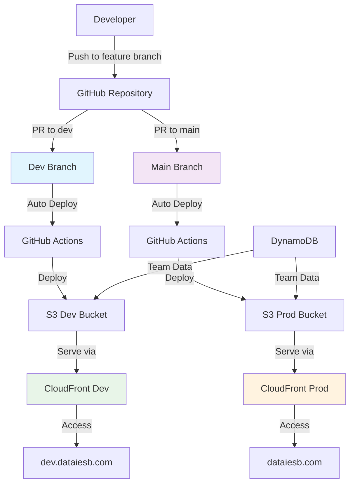

# Data IESB Website

[](https://github.com/Data-iesb/Data-IESB/actions/workflows/deploy-dev.yml)

Official website for Data IESB - Centro Universitário IESB's Data Science and Analytics initiative.

## 🌐 Live Sites

- **Production**: https://dataiesb.com
- **Development**: https://d2v66tm8wx23ar.cloudfront.net
- **Target Dev Domain**: https://dev.dataiesb.com *(DNS setup pending)*

## 📊 Architecture Overview


```mermaid
graph TB
    A[Developer] -->|Push to feature branch| B[GitHub Repository]
    B -->|PR to dev| C[Dev Branch]
    B -->|PR to main| D[Main Branch]
    
    C -->|Auto Deploy| E[GitHub Actions]
    D -->|Auto Deploy| F[GitHub Actions]
    
    E -->|Deploy| G[S3 Dev Bucket]
    F -->|Deploy| H[S3 Prod Bucket]
    
    G -->|Serve via| I[CloudFront Dev]
    H -->|Serve via| J[CloudFront Prod]
    
    I -->|Access| K[dev.dataiesb.com]
    J -->|Access| L[dataiesb.com]
    
    M[DynamoDB] -->|Team Data| G
    M -->|Team Data| H
    
    style C fill:#e1f5fe
    style D fill:#f3e5f5
    style I fill:#e8f5e8
    style J fill:#fff3e0
```

## 🏗️ Project Structure

```
Data-IESB/
├── src/                          # Website source files
│   ├── index.html               # Homepage
│   ├── quem-somos.html          # About us page
│   ├── equipe.html              # Team page (dynamic)
│   ├── miv.html                 # Color templates
│   ├── style/                   # CSS files
│   ├── js/                      # JavaScript files
│   └── img/                     # Images and assets
├── .github/                     # GitHub configuration
│   ├── workflows/               # CI/CD pipelines
│   ├── ISSUE_TEMPLATE/          # Issue templates
│   ├── CODEOWNERS              # Code review assignments
│   └── pull_request_template.md # PR template
├── deploy-dev.sh               # Development deployment script
├── dev-config.json             # Development environment config
└── DEV-README.md               # Development documentation
```

## 🚀 Quick Start for New Contributors

> **Important**: This repository uses `dev` as the default branch to protect production!

### 1. Clone the Repository
```bash
git clone https://github.com/Data-iesb/Data-IESB.git
cd Data-IESB

# You'll automatically be on the 'dev' branch (safe for beginners!)
git branch
# * dev
```

### 2. Create Your Feature Branch
```bash
# Create a new feature branch from dev
git checkout -b feature/your-feature-name

# Make your changes
# ... edit files ...

# Commit your changes
git add .
git commit -m "feat: describe your changes"

# Push your feature branch
git push origin feature/your-feature-name
```

### 3. Create Pull Request
- Go to GitHub and create a PR from your feature branch to `dev`
- Fill out the PR template
- Request review from team members
- After approval, your changes will be automatically deployed to development

## 🔄 Branch Strategy

### Branch Overview
- **`dev`** ← **Default branch** (safe for new contributors)
  - Development environment
  - Auto-deploys to https://d2v66tm8wx23ar.cloudfront.net
  - All new features start here
  
- **`main`** ← Production branch (protected)
  - Production environment
  - Deploys to https://dataiesb.com
  - Requires admin approval

### Workflow
```
feature/new-feature → dev → (testing) → main → production
```

## 🛡️ Branch Protection

### Dev Branch (Default)
- ✅ Requires 1 approval
- ✅ Auto-deployment to development
- ✅ Status checks required
- ✅ Safe for new contributors

### Main Branch (Production)
- 🔒 Requires 2+ approvals
- 🔒 Admin-only access
- 🔒 Strict status checks
- 🔒 Code owner reviews required

## 🧪 Development Environment

### Infrastructure
- **S3 Bucket**: `dev-dataiesb`
- **CloudFront**: `E142Z1CPAKR8S8`
- **Auto-deployment**: On push to `dev` branch

### Local Development
```bash
# Serve locally (if you have a local server)
cd src
python -m http.server 8000
# Visit: http://localhost:8000

# Or use any static file server
npx serve src
```

## 🎨 Features

### Dynamic Team Management
- Team data loaded from DynamoDB
- Professional role badges
- Responsive design
- Real-time updates

### Color System
- Brand-consistent color palette
- Professional color combinations
- Reusable templates in `miv.html`
- Amazon Q integration ready

### Responsive Design
- Mobile-first approach
- Cross-browser compatibility
- Accessibility compliant

## 👥 Team

### Coordination
- Professor Sérgio da Costa Côrtes
- Professora Simome de Araújo Góes Assis
- Professora Natália Ribeiro de Souza Evangelista

### Technical Team
- **Roberto Moreira Diniz** - DevOps & Infrastructure
- **Ilton Ferreira Mendes Neto** - Database Administrator
- **Marley Abe Silva** - Developer
- **Leonardo Araújo Pereira** - DataScience Team Leader

### Data Science Team
- Guilherme Rocha Duarte
- Leonardo Borges Silva Braga
- Pedro Martins Rodrigues
- William Wallace Ribeiro Matos

## 🚀 Deployment

### Automatic (Recommended)
1. Push to `dev` branch
2. GitHub Actions automatically deploys
3. Changes live in 5-15 minutes

### Manual
```bash
# Ensure you're on dev branch
git checkout dev

# Run deployment script
./deploy-dev.sh
```

## 📋 Contributing

### For New Contributors
1. **Fork** the repository
2. **Clone** your fork (automatically on `dev` branch)
3. **Create** feature branch: `git checkout -b feature/amazing-feature`
4. **Make** your changes
5. **Test** locally
6. **Commit** with clear messages
7. **Push** to your fork
8. **Create** Pull Request to `dev` branch

### Code Style
- Use semantic HTML5
- Follow CSS BEM methodology
- Write clear, commented JavaScript
- Maintain responsive design
- Test on multiple browsers

### Commit Messages
```bash
feat: add new team member display
fix: resolve mobile navigation issue
style: update color scheme consistency
docs: improve setup instructions
```

## 🔧 Configuration

### Environment Variables
- Development environment uses `dev-config.json`
- Production settings managed separately
- AWS credentials via GitHub Secrets

### AWS Resources
- **S3**: Static website hosting
- **CloudFront**: CDN and HTTPS
- **DynamoDB**: Team member data
- **Route 53**: DNS management (pending)

## 📚 Documentation

- **[Development Guide](DEV-README.md)** - Complete dev environment docs
- **[Branch Change Guide](change-default-branch.md)** - How to change default branch
- **[Color Templates](src/miv.html)** - Brand color combinations

## 🐛 Issues & Support

### Reporting Issues
- Use issue templates for bugs and features
- Include environment details
- Add screenshots when helpful
- Tag appropriate team members

### Getting Help
- Check existing issues first
- Use discussions for questions
- Contact DevOps team for infrastructure issues

## 📄 License

This project is maintained by Centro Universitário IESB for educational and research purposes.

---

## 🎯 Quick Links

- **Development Site**: https://d2v66tm8wx23ar.cloudfront.net
- **Production Site**: https://dataiesb.com
- **Issues**: https://github.com/Data-iesb/Data-IESB/issues
- **Pull Requests**: https://github.com/Data-iesb/Data-IESB/pulls
- **Actions**: https://github.com/Data-iesb/Data-IESB/actions

**Default Branch**: `dev` (safe for new contributors!)  
**Production Branch**: `main` (protected)
